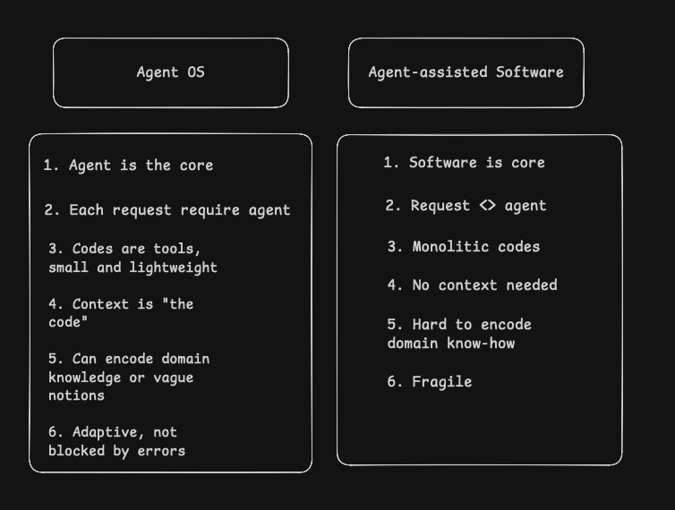

# How to Build Reliable AI Agents with Claude Code

A practical guide to creating, testing, and deploying Claude Code agents -- from first principles to production.

---

## Agent OS vs Agent-Assisted Software

Before diving in, it helps to understand the shift in mental model. Building agents is not the same as building software that uses AI. It's a fundamentally different architecture:



| | Agent OS | Agent-Assisted Software |
|---|---|---|
| **Core** | Agent is the core | Software is the core |
| **Requests** | Each request requires an agent | Requests don't need agents |
| **Code** | Small, lightweight tools | Monolithic codebases |
| **Context** | Context IS the code | No context needed |
| **Domain knowledge** | Can encode domain knowledge and vague notions | Hard to encode domain know-how |
| **Resilience** | Adaptive, not blocked by errors | Fragile |

The guide below teaches you to build in the **Agent OS** paradigm -- where the agent is the program, code is just tooling, and your domain expertise is the real product.

---

## Table of Contents

- [What Are Agents and Skills?](#what-are-agents-and-skills)
- [The 6 Principles](#the-6-principles)
- [The Build-Deploy Workflow](#the-build-deploy-workflow)
- [Patterns That Work](#patterns-that-work)
- [Real-World Examples](#real-world-examples)
- [Agent To Create: Influencer Post Monitor](#agent-to-create-influencer-post-monitor--engagement-router)
- [Common Pitfalls](#common-pitfalls)
- [Quick Reference](#quick-reference)

---

## What Are Agents and Skills?

|                 | Agent                                  | Skill                            |
| --------------- | -------------------------------------- | -------------------------------- |
| **Purpose**     | Orchestrates a specific job end-to-end | Provides a reusable capability   |
| **Analogy**     | A program                              | A library                        |
| **Example**     | "Enrich a list of companies"           | "Analyze product metrics"        |
| **Location**    | `.claude/agents/<name>.md`             | `.claude/skills/<name>/skill.md` |
| **Invoked via** | `Task` tool (subagent)                 | `/skill-name`                    |

Compose skills inside agents for modularity. Each skill can be developed, tested, and iterated independently. When an agent breaks, you know whether the issue is in the orchestration logic or in a specific capability.

```
Agent: daily-activity-report
  Uses: /product-analysis    (skill -- pulls and analyzes metrics)
  Uses: /report-generator    (skill -- formats output)
  Uses: /slack-poster         (skill -- posts to channel)
```

---

## The 6 Principles

### 1. Agent = Job-to-be-done, Skill = Capability

Define agents around **outcomes** ("enrich a company list"), not around tools. Define skills around **capabilities** ("format data as CSV"). Keep skills small enough to test in one `/clear` cycle.

### 2. Develop by Doing, Not by Prompting

Never auto-generate an agent from a description. Instead:

1. `/clear` to start fresh
2. Manually do the task step by step in normal Claude Code mode
3. Capture the **action trace** -- every tool call, parameter, and output
4. Codify the trace into the agent definition

> Why? Auto-generated agents hallucinate tool names and parameters. Prototyping captures the real workflow.

### 3. Context is the Enemy (RLM Pattern)

The context window is finite. Keep it lean by:

- **Writing outputs to files**: Scripts save tool results to `tmp/`, the model reads only what it needs
- **Using indexed step files**: The agent reads one step at a time, not the entire definition
- **Partitioning large tasks**: Process in batches (e.g., 10 companies at a time)
- **Preparing context layers**: Domain knowledge goes in reference files (`@context/criteria.md`), not inline

This follows MIT's [Recursive Language Model](https://arxiv.org/abs/2502.09382) pattern: treat context as an external environment, use code to peek/grep/partition/map over data.

### 4. Make the Model Plan Before It Acts

Before executing any steps, generate an explicit task list with a dependency graph. This enables:

- Parallel execution where possible
- Visible progress tracking
- Easier recovery when steps fail

### 5. Validate with Hooks, Not Hope

Define expected output schemas for each step. Use hooks to enforce them:

- Schema validation catches structural errors (missing fields, wrong types)
- Content validation catches semantic errors (empty results, out-of-range values)
- Failed validation forces the model to retry, creating a self-correcting loop

### 6. The Real Product is Encoded Expertise

The value is not the code -- it's the domain knowledge encoded within. A domain expert using Claude Code produces better agents than a domain expert working with an engineer, because the expert's tacit knowledge gets directly captured in the action trace.

---

## The Build-Deploy Workflow

### Prerequisites

```bash
npm install -g @anthropic-ai/claude-code      # Claude Code
curl -fsSL https://cli.datagen.dev/install.sh | sh  # DataGen CLI
brew install gh                                 # GitHub CLI

# One-time login (run in a regular terminal, not inside Claude Code)
gh auth login
datagen login
```

---

### Phase 1: Build (Steps 0-5)

#### Step 0 -- Prepare the Context Layer

Before writing agent logic, identify what reference material the agent needs. Ask:

| Question | Produces |
|----------|----------|
| What does "good" look like? | `output-template.md` |
| What rules drive decisions? | `criteria.md`, `grading-rubric.md` |
| What domain knowledge is assumed? | `domain-context.md` |
| What existing data sources are relevant? | `@data/customers.csv` references |
| What are the edge cases? | `edge-cases.md` |

Organize these in a `context/` directory and reference them with `@` links in the agent definition:

```markdown
Follow the format in @context/output-template.md.
Score companies using @context/criteria.md.
Watch for issues described in @context/edge-cases.md.
```

**Examples of context layers by agent type:**

| Agent Type | Context Files |
|-----------|--------------|
| Meeting summary | `summary-guideline.md`, `example-summary.md` |
| Company enrichment | `icp-criteria.md`, `field-mapping.md` |
| Outreach review | `review-checklist.md`, `compliance-rules.md` |
| Daily report | `report-template.md`, `metric-definitions.md` |
| Influencer monitor | `influencer-list.md`, `classification-rules.md`, `comment-style.md` |

#### Step 1 -- Look Up the Current Agent Format

Before writing any `.md` file, verify the current frontmatter format. Agent files require YAML frontmatter with at minimum `name` and `description`:

```yaml
---
name: my-agent
description: What this agent does in one sentence.
---
```

Skills live in `.claude/skills/<name>/skill.md`. Agents live in `.claude/agents/<name>.md`.

#### Step 2 -- Register the Agent

1. Run `/agent` to create a new agent
2. Select the project
3. Grant access to all tools the agent needs
4. Write a clear scope description

#### Step 3 -- Develop (the Critical Step)

1. `/clear` for a fresh context
2. **Manually walk through the task** in normal Claude Code mode
3. Note every tool call, parameter, output, and error recovery
4. This produces the **action trace** -- ground truth for your agent

> This is the most important step. Do not skip it.

#### Step 4 -- Codify the Agent Definition

Distill the action trace into a structured definition:

```
agent-definition/
  step-01-gather-inputs.md
  step-02-enrich-data.md
  step-03-validate-results.md
  step-04-generate-output.md
```

Each step specifies:
- **Input**: What data it reads
- **Tool(s)**: Which tools to call with what parameters
- **Expected output**: File path and schema
- **Error handling**: What to do when it fails

#### Step 5 -- Test and Iterate

1. Restart Claude Code (`claude -r`) to pick up the new agent
2. Run the agent on the target task
3. Observe: Does it follow steps? Handle errors? Produce correct output?
4. Go back to Step 4 and refine

---

### Phase 2: Deploy (Steps 6-8)

#### Step 6 -- Push to GitHub

```bash
# New repo
gh repo create <owner>/<repo-name> --private --source=. --push

# Existing repo
git add .claude/agents/ .claude/skills/
git commit -m "Add agent definition"
git push
```

#### Step 7 -- Connect to DataGen

```bash
datagen github connect-repo <owner>/<repo-name>
datagen github sync <owner>/<repo-name>
datagen agents list --repo <owner>/<repo-name>   # note the agent UUID
```

#### Step 8 -- Deploy, Configure, and Schedule

```bash
# Deploy
datagen agents deploy <agent-id>

# Configure
datagen agents config <agent-id> --set-prompt "Enrich {{payload.company}}"
datagen agents config <agent-id> --secrets API_KEY_1,API_KEY_2
datagen agents config <agent-id> --notify-success true

# Run manually
datagen agents run <agent-id> --payload '{"company": "acme.com"}'

# Or schedule
datagen agents schedule <agent-id> --cron "0 9 * * 1-5" --timezone "America/New_York"
```

---

## Patterns That Work

### Script-Based Outputs (RLM Pattern)

Instead of flooding the context window with tool results:

```python
# scripts/scrape_company.py
import json
results = call_tool("firecrawl_scrape", {"url": domain})
with open(f"tmp/scrape_{domain}.json", "w") as f:
    json.dump(results, f)
```

The model then peeks at the file, greps for specific fields, or processes it in chunks -- without ever loading the full output into context.

### Skill Composition

Break complex agents into composable skills:

```
Agent: weekly-pipeline-report
  Step 1: /crm-data-pull      -> tmp/pipeline_data.json
  Step 2: /metrics-calculator  -> tmp/metrics.json
  Step 3: /report-generator    -> tmp/report.slack
  Step 4: Post to Slack
```

Each skill has its own test cycle. Fix `/report-generator` without touching the agent.

### Batch Processing

For large datasets, partition into manageable chunks:

```
tmp/batch_01.json  (records 1-10)
tmp/batch_02.json  (records 11-20)
...
```

Process each batch independently, then merge. This prevents context bloat and enables recovery if a batch fails.

### DataGen SDK for Tool Execution

When your agent needs to call DataGen tools programmatically:

```python
from datagen_sdk import DatagenClient

client = DatagenClient()

# Discover tools
matches = client.execute_tool("searchTools", {"query": "send email"})

# Check schema before calling
details = client.execute_tool("getToolDetails", {"tool_name": "mcp_Gmail_gmail_send_email"})

# Execute
result = client.execute_tool("mcp_Gmail_gmail_send_email", {
    "to": "user@example.com",
    "subject": "Hello",
    "body": "Hi from DataGen!"
})
```

---

## Real-World Examples

### Example 1: Company Enrichment Agent (12 Steps)

**Job**: Given a CSV of company domains, produce enriched profiles ready for CRM import.

```
Step 1:   Parse input CSV, validate domains         -> tmp/input_companies.json
Step 2:   Scrape each company website (Firecrawl)    -> tmp/scrape_{domain}.json
Step 3:   Extract firmographics from scrape results
Step 4:   Run LinkedIn company search                -> tmp/linkedin_{domain}.json
Step 5:   Extract key contacts from LinkedIn
Step 6:   Detect tech stack (BuiltWith)              -> tmp/techstack_{domain}.json
Step 7:   Score against ICP criteria                 -> tmp/scores.json
Step 8:   Validate all fields against schema
Step 9:   Merge into unified profile per company
Step 10:  Generate summary statistics
Step 11:  Format as CRM-ready CSV
Step 12:  Post summary to Slack
```

**Key patterns**: Script-based outputs per step, batch processing (10 companies at a time), schema validation at step 8, dedicated skills for steps 2/4/6.

---

### Example 2: Outreach Review Agent (6 Steps)

**Job**: Review HeyReach outreach sequences for quality and compliance.

**How it was built** (action trace method):
1. Manually reviewed 5 sequences in Claude Code
2. Noticed patterns: generic openers, missing personalization, too-long messages
3. Codified rules: message length limits, personalization tokens, CAN-SPAM compliance, follow-up spacing
4. Structured into a 6-step pipeline

```
Step 1:  Parse HeyReach export              -> tmp/sequences.json
Step 2:  Extract messages and metadata per sequence
Step 3:  Run quality checks (length, personalization, spacing)
Step 4:  Run compliance checks (CAN-SPAM, LinkedIn ToS)
Step 5:  Score each sequence (0-100) with breakdown
Step 6:  Generate review report with fix recommendations
```

**Key patterns**: Developed by doing (review criteria came from actual reviews), encoded domain expertise (length limits, spacing rules), hook validation on each review.

---

### Example 3: Daily Activity Report (Skill Composition)

**Job**: Pull yesterday's product metrics, analyze trends, generate report, post to Slack.

```
Skill: /product-analysis
  - Pulls metrics from PostHog API
  - Computes day-over-day and week-over-week changes
  - Identifies anomalies (> 2 std devs from 30-day mean)
  -> tmp/metrics_analysis.json

Skill: /report-generator
  - Formats analysis into structured report
  - Supports Slack, HTML, and Markdown output
  -> tmp/report.{format}

Agent orchestration:
  Step 1: Call /product-analysis (date = yesterday)
  Step 2: Peek at tmp/metrics_analysis.json for anomalies
  Step 3: Call /report-generator (format = slack)
  Step 4: Post to #daily-metrics
  Step 5: If anomalies found, also post to #alerts
```

**Key patterns**: Skill composition (agent delegates, doesn't do analysis itself), context management (peeks at file for routing decisions), conditional execution (anomaly alerting).

---

## Agent To Create: Influencer Post Monitor & Engagement Router

This is a real agent we can build together. It solves a concrete problem -- you're consuming tons of GTM and Claude Code content from LinkedIn influencers, but by the time you see a relevant post, the engagement window is gone. Meanwhile, your own posts get zero traction because you're resharing company content instead of engaging in the conversations that matter.

This agent fixes that. And building it teaches you every principle above.

### The Problem

You follow 20-30 LinkedIn influencers in the GTM engineering / Claude Code / AI agent space. But you can't realistically monitor all of them every day. The first 2 hours after someone posts determine 80% of that post's reach -- if you comment early, you ride the wave. If you comment 8 hours later, nobody sees it.

The result: you're stuck in a cycle of resharing Grazitti content with zero personal engagement, while the people building audiences are the ones showing up in the right conversations at the right time.

### The Agent

**Name**: `influencer-post-monitor`

**Schedule**: Daily at 7:00 AM IST (before your workday starts)

**Input**: A curated list of 20-30 LinkedIn influencer profile URLs

**Output**: A Slack digest with classified posts and draft comments, ready for you to review and post

### Step-by-Step Workflow

```
Step 1:  Load influencer list
         Read influencer-list.json (name, LinkedIn URL, relevance tags)
         -> tmp/influencers.json

Step 2:  Pull latest posts (batch processing -- 5 at a time)
         For each influencer, fetch their most recent posts from the last 24h
         via LinkedIn MCP tool
         -> tmp/posts_{handle}.json per influencer

Step 3:  Classify each post
         Using classification rules from @context/classification-rules.md:

         | Category              | Criteria                                           |
         |-----------------------|---------------------------------------------------|
         | ENGAGE NOW            | High relevance + posted < 2hrs ago + high reach potential |
         | CONTENT INSPIRATION   | Trending topic you could write your own take on    |
         | LEAD SIGNAL           | Influencer mentioned a pain point Grazitti solves  |
         | SKIP                  | Irrelevant, low value, or engagement window closed |

         -> tmp/classified_posts.json

Step 4:  Draft comments for "ENGAGE NOW" posts
         For each post classified as ENGAGE NOW:
         - Read the full post content
         - Reference @context/comment-style.md for voice/tone guidelines
         - Draft a substantive comment (not "Great post!" -- something that
           adds value, shares a perspective, or asks a smart question)
         - Include reasoning: why this post matters, why comment now
         -> tmp/draft_comments.json

Step 5:  Build the Slack digest
         Format all results into a single Slack message:

         --- ENGAGE NOW (act within 2 hours) ---
         [Post title] by [Author] -- posted 45 min ago
         Draft comment: "..."
         [LinkedIn link]

         --- CONTENT INSPIRATION ---
         [Post title] by [Author]
         Topic angle: "..."

         --- LEAD SIGNALS ---
         [Post title] by [Author]
         Signal: "mentioned struggling with community platform migration"

         -> tmp/slack_digest.json

Step 6:  Post to Slack
         Push the digest to your #linkedin-engagement channel
         If any LEAD SIGNAL posts found, also push to #leads channel
```

### Context Layer (What to Prepare Before Building)

| File | Purpose |
|------|---------|
| `influencer-list.json` | 20-30 profiles with name, URL, and tags (e.g., "claude-code", "gtm-engineering", "ai-agents") |
| `classification-rules.md` | What makes a post "engage now" vs "content inspiration" vs "lead signal" -- this is YOUR judgment, encoded |
| `comment-style.md` | Your voice guidelines: how you want to sound in comments (thoughtful, technical, practical -- not salesy) |
| `relevance-criteria.md` | What topics are relevant to your niche: agent architecture, Claude Code workflows, GTM automation, community platforms |

### Why This Agent Works as a Learning Exercise

Every principle from this guide shows up:

| Principle | How it applies |
|-----------|---------------|
| **Job-to-be-done** | The agent does one job: turn influencer noise into engagement actions |
| **Develop by doing** | Step 3 (classification): you'll manually classify 10 posts first, capture your reasoning, then codify the rules |
| **Context is the enemy** | Posts are saved to `tmp/` files per influencer, processed in batches of 5 -- never all in context at once |
| **Plan before act** | Task list with dependencies: can't draft comments (Step 4) until classification (Step 3) is done |
| **Validate with hooks** | Every classified post must have a category; every draft comment must be > 50 chars and reference the post content |
| **Encoded expertise** | The classification rules and comment style ARE the product -- they encode your judgment about what's worth engaging with |

### Why This Beats n8n / Clay / Manual Work

| Approach | Limitation |
|----------|-----------|
| **Manual monitoring** | Can't check 20-30 profiles daily; always miss the 2-hour window |
| **n8n / Zapier** | Can trigger on "new post" but can't read the post and decide "this is worth engaging with because..." |
| **Clay** | Great for enrichment, not for semantic classification + contextual comment drafting |
| **This agent** | Reads the post, understands relevance to YOUR niche, classifies with YOUR judgment, drafts comments in YOUR voice |

### Proof of Concept

We already run a working version of this pattern -- `linkedin-post-search` and `linkedin-prospect-monitor` agents -- for our own GTM. Same architecture, same principles. The agent you'd build follows the exact same structure, just tuned to your influencer list and engagement goals.

### How to Build It (Applying the Workflow)

1. **Step 0**: Write `classification-rules.md` together -- manually classify 10 real influencer posts and capture your reasoning
2. **Step 3**: Prototype the workflow -- `/clear`, then manually pull posts and classify them in Claude Code
3. **Step 4**: Codify the trace into the agent definition with indexed steps
4. **Step 5**: Test it, iterate, get the Slack output looking right
5. **Steps 6-8**: Deploy to DataGen on a daily cron schedule

Once deployed, you wake up every morning with a Slack digest telling you exactly which posts to engage with, and a draft comment ready to go. The 2-hour engagement window problem is solved. And you've learned the full agent architecture by building something real.

---

## Common Pitfalls

| Pitfall | What Happens | Fix |
|---------|-------------|-----|
| **Hallucinated prompts** | Auto-generating agents from descriptions produces wrong tool names and params | Always prototype first (Step 3) |
| **Skipping the trace** | Jumping straight to the agent definition without manual walkthrough | Do the task manually first -- this is the #1 cause of brittle agents |
| **Context bloat** | Putting all steps inline; model loses focus | Use indexed step files and `tmp/` outputs |
| **Monolithic agents** | One massive agent instead of composed skills | Break into skills with tight feedback loops |
| **No validation** | Hoping the model produces correct output | Define schemas, enforce with hooks |
| **Missing frontmatter** | Agent `.md` files without required YAML headers | Always include `name` and `description` in frontmatter |

---

## Quick Reference

### Agent File Structure

```
project/
  .claude/
    agents/
      my-agent.md              # Agent definition (YAML frontmatter + steps)
    skills/
      my-skill/
        skill.md               # Skill definition
  context/
    criteria.md                # Domain knowledge
    output-template.md         # Reference output
  scripts/
    helper.py                  # Tool-calling scripts
  tmp/                         # Intermediate outputs (gitignored)
```

### DataGen CLI Cheat Sheet

| Task | Command |
|------|---------|
| List agents | `datagen agents list` |
| Show agent details | `datagen agents show <id>` |
| Deploy | `datagen agents deploy <id>` |
| Undeploy | `datagen agents undeploy <id>` |
| Run manually | `datagen agents run <id>` |
| Run with payload | `datagen agents run <id> --payload '{...}'` |
| Set prompt | `datagen agents config <id> --set-prompt "..."` |
| Attach secrets | `datagen agents config <id> --secrets K1,K2` |
| Push a secret | `datagen secrets set KEY=VALUE` |
| Add schedule | `datagen agents schedule <id> --cron "..." --timezone "..."` |
| View logs | `datagen agents logs <id>` |
| Connect repo | `datagen github connect-repo owner/repo` |
| Sync repo | `datagen github sync owner/repo` |

### The Workflow in One Line

```
Context layer -> Register -> Prototype manually -> Codify trace -> Test -> Push -> Connect -> Deploy
```
